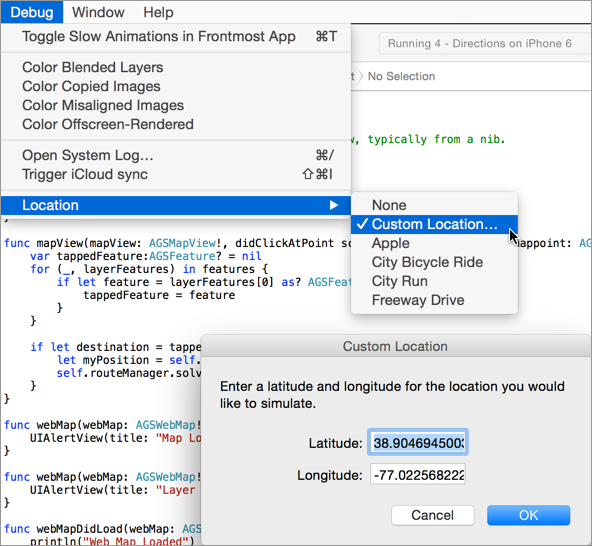

# Routing (ArcGIS Runtime SDK for iOS)

A very simple sample that gets directions from your current location to an embassy in Washington, DC.

### Setup
You must modify the DemoCredentials.swift file to include your ArcGIS Online username and password (Organization or Developer account). Don't go making pull requests of that :)

To get a free ArcGIS Online Developer Account, visit [developers.arcgis.com](http://developers.arcgis.com) and sign up.

You may also want to specify the iOS Simulator's location to be somewhere in DC (e.g. [38.905,-77.023](http://www.arcgis.com/home/webmap/viewer.html?center=-77.023,38.905&level=14)):

